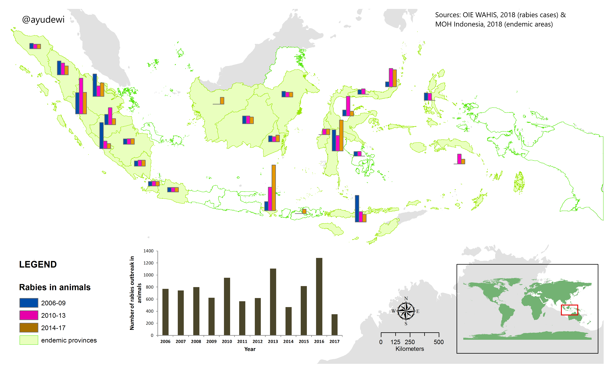
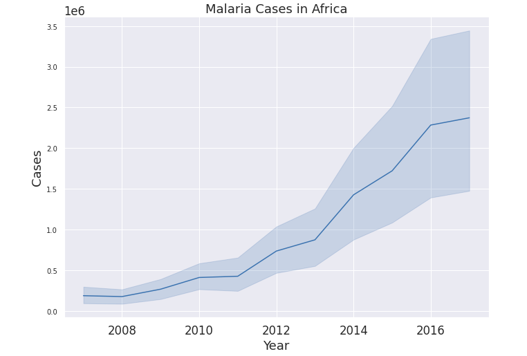
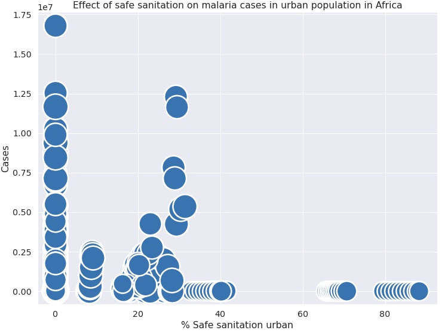
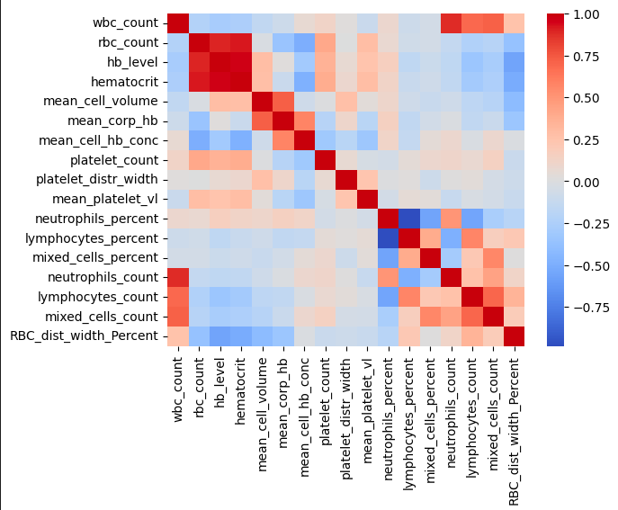
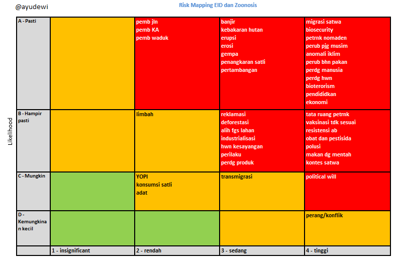

# Ayu Putu Madri Dewi

 Master of Public Health in Biostatistics (MPH) and Doctor of Veterinary Medicine (DVM) 

<a href="https://www.linkedin.com/in/ayuputumadridewi/"> LinkedIn </a> |
<a href="https://www.twitter.com/ayupmdewi"> Twitter </a> |
<a href="mailto:ayuputu.madridewi@gmail.com">Email </a> |
<a href="https://github.com/ayudewi"> GitHub </a> |
<a href="https://orcid.org/0000-0001-7645-6424"> ORCiD </a>

<h2> Skills and example of epidemiology and data science projects </h2>

<h3> Skills </h3>
<li> Analysed regression problem, classification problem, and clustering problem.  </li>
<li> Data visualisation using line, bar, scatter, histogram, KDE, heatmap, GIS maps. </li>
<li> Data generation and coding in Jupyter Notebook, R, Stata, Excel, and VS Code. </li>

<h3> Example 1: Rabies outbreaks in Indonesia </h3>
Below is an example of map of rabies cases and area where rabies are endemic in Indonesia. I produced this map using ArcGIS and published data from World Organisation for Animal Health (OIE) <a href="https://www.woah.org/en/what-we-do/animal-health-and-welfare/disease-data-collection/world-animal-health-information-system/"> database </a> and Ministry of Health of Republic Indonesia's <a href="https://sehatnegeriku.kemkes.go.id/baca/umum/20200928/4735079/8-34-provinsi-indonesia-bebas-rabies/"> information. </a>
<figure>

</figure>

<h3> Example 2: Malaria in Africa, 2007-2017 </h3>
Below is example of analysis of malaria in Africa to analyse effect of preventive measures on malaria cases. Check the detail and the code in repository <a href="https://www.kaggle.com/code/ayudewi/malaria-in-africa-2007-2017">here</a>.
<figure>
  
  
  
</figure>

<h3> Example 3: Disease prediction using machine learning </h3>
Below is example of predicting malaria infection in patients based on blood clinical features. Check the detail and the code in repository <a href="https://github.com/ayudewi/Detecting-Malaria-using-Machine-Learning/blob/74a21867ccf90f7738ea01b95a37cf333c6294f7/malaria-machinelearning.ipynb">here</a>.
<figure>

</figure>

<h3> Example 4: Bioinformatics analysis to investigate disease origin </h3>
Under construction, please comeback later

<h3> Example 5: Risk mapping tool for risk assessment </h3>
Below is example of a simple application for risk mapping and risk assessment I created using VB in Ms. Excel. Check the application in <a href="https://github.com/ayudewi/Portfolio/blob/main/riskmapIND.xlsm"> here </a>. Sorry, it is still in the Indonesian language. In principle, the matrix shows how likely and the level of impact of potential drivers toward disease outbreaks are, demonstrated by the colors (red-yellow-green). This tool also can be used for other purposes such as risk registers in project management to help monitor and evaluate teams and activities, etc. Please let me know by <a href="mailto:ayuputu.madridewi@gmail.com"> email </a> should you need my guidance on how to perform this.
<figure>

</figure>  
  

<h4> Thank you ! </h4>
