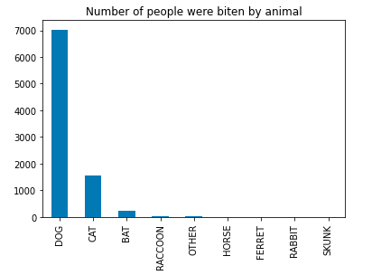
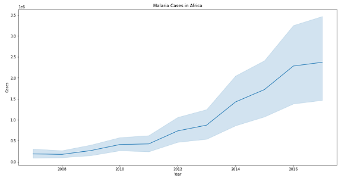

# Ayu Putu Madri Dewi

 Master of Public Health in Biostatistics (MPH) and Doctor of Veterinary Medicine (DVM) 

<a href="https://www.linkedin.com/in/ayuputumadridewi/"> LinkedIn </a> |
<a href="https://www.twitter.com/ayupmdewi"> Twitter </a> |
<a href="mailto:ayudew262@gmail.com">Email </a> |
<a href="https://github.com/ayudewi"> GitHub </a> |
<a href="https://orcid.org/0000-0001-7645-6424"> ORCiD </a>

<h2> Skills and example of data science projects </h2>

<h3> Skills </h3>
<li> Analysed regression problem, classification problem, and clustering problem.  </li>
<li> Data visualisation using line, bar, scatter, histogram, KDE, heatmap, GIS map etc. </li>
<li> Data generation and coding in Jupyter Notebook, R, Stata, Excel, and VS Code. </li>

<h3> Example 1: Rabies and animal bites </h3>
Below is example of analysis of animal bites and rabies. Check the detail and the code in repository <a href="https://www.kaggle.com/code/ayudewi/rabies">here</a>.
<figure>

</figure>

<h3> Example 2: Malaria in Africa, 2007-2017 </h3>
Below is example of analysis of malaria in Africa to analyse effect of preventive measures on malaria cases. Check the detail and the code in repository <a href="https://www.kaggle.com/code/ayudewi/malaria-in-africa-2007-2017">here</a>.
<figure>

</figure>

<h3> Example 3: Disease prediction using machine learning </h3>
Under construction, please comeback later

<h3> Example 4: Bioinformatics analysis to investigate disease origin </h3>
Under construction, please comeback later

<h4> Thank you ! </h4>
